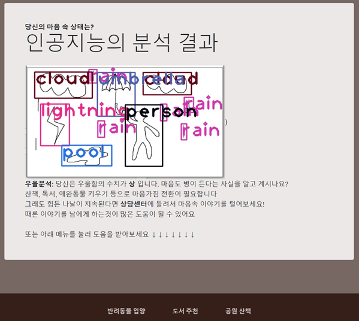

# AiSchoolHackathon
## 주제 : 언택트 시대에 맞는 데이터를 활용한 웹 서비스 제작

## 서비스 주제 : 코로나로 인한 마음의 병을 치유하기 위한 자가 진단 및 치료 서비스

### 1) 개발동기
코로나 블루로 인해 많은 사람들이 우울증을 앓고 있음. 하지만 자신이 우울증인지 모르거나 자연히 치료될 것이라 생각하여 방치하게 되는 현상 발생. __우울증 심화로 인한 극단적 사고 방지 위한 진단 및 치료 서비스 제공__
### 2) 개발내용
Yolo를 활용한 빗속의 사람(PITR) 그림 검사 진행을 통해 심리 진단. 우울 정도에 따라 우울증 해소에 도움되는 방법 추천.
### 3) 데모사진

### 4) 한계점 : 시간적 한계로 완성도 있게 만들지 못했으며, 우울증 해소를 위한 방법 중 가장 중요한 대화를 통해 해소하는 상담치료를 구현하진 못했음.

## 참고자료
- 크롤링 : 교보문고
- 공공데이터
- yolo : https://bong-sik.tistory.com/16 , https://www.youtube.com/channel/UCrydcKaojc44XnuXrfhlV8Q
